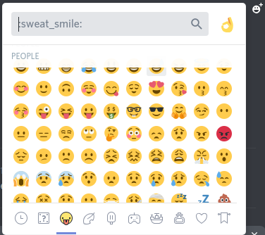

# Hello VuePress (Pão)

## Discord 101

::: tip
O Discord é a principal ferramenta de comunicação entre o CodeLab, então se você nunca teve contato com ele ou tem dificuldades com o seu uso, listamos a seguir algumas *features* que podem ser úteis para aprimorar a sua experiência com o Discord!
:::

### Formatação de texto
Em relação à edição de texto, é possível adicionar um certo nível de ***açúcar*** à ele, utilizando marcações próximas a Markdown, se você ainda não conhece esse tipo de marcação, listamos a seguir alguns exemplos:
- <u>sublinhado</u> \_\_sublinhado\_\_
- ~~riscado~~ \~\~riscado\~\~
- *itálico* \*itálico\* ou \_itálico\_
- *<u>itálico sublinhado</u>* \_\_\*itálico sublinhado\*\_\_
- **negrito** \*\*negrito\*\*
- **<u>negrito sublinhado</u>** \_\_\*\*negrito sublinhado\*\*\_\_
- ***itálico/negrito*** \*\*\*itálico/negrito\*\*\*
- ***<u>itálico/negrito sublinhado</u>*** \_\_\*\*\*itálico/negrito sublinhado\*\*\*\_\_

Caso você não queira que o estilo do seu texto mude, basta usar um *backslash* (barra invertida) antes dos caracteres especiais.

Outra coisa bem útil em formatação de texto são os blocos de código para destacar algum texto que você tenha interesse, podemos usar blocos para apenas uma linha de texto como `aqui temos um bloco de linha única`, para fazer isso para usar *backtick* (a famosa crase), antes e depois do texto que você tem interesse em marcar, \`desta forma\`. Enquanto isso, caso seja do seu interesse criar
```
um bloco
de texto
grande como
este
```
basta utilizar **3** *backticks* da seguinte forma<br/>
\`\`\`<br/>
antes<br/>
e<br/>
depois<br/>
\`\`\`

### Buscas
Como no nosso Discord há informações de todo tipo rolando o tempo todo, vale destacar uma das principais funcionalidades da ferramenta de busca oferecida pelo Discord. No canto superior direito há uma barra de busca que realiza uma busca simples pela palavra inserida, mas as vezes isso não pode ser tão útil, podemos centralizar nossas buscas à mensagens de um único membro, mensagens em um canal específico ou então mensagens contendo arquivos/imagens, entre outras opções que facilitam enormemente nossa vida na hora de buscar algo que está perdido por aí. Vale lembrar que podemos criar combinações com essas tags de buscas, aprimorando ainda mais a busca.

Todas as opções possíveis são listadas ao clicar na barra de pesquisa com o tipo de entrada esperado, mas vale deixar aqui alguns exemplos de como utiliza-lás:
```
from: user X (mensagens de um integrante X)
mention: user Y (mensagens que mencionam um integrante Y)
has: file (mensagens que contenham um arquivo como uma imagem, também podemos colocar link ou embed como opção)
in: #meta (mensagens do canal meta)
before: data específica (mensagens após uma data)
during: data específica (mensagens durante uma data)
after: data específica (mensagens após uma data)
```

### Padrões usados para votações
Essa parte é mais uma questão de padrão utilizado pelo grupo do que algo relacionado com a ferramenta em si. Sendo nosso grupo democrático, em diversos momentos se encontramos em uma situação que é necessário realizar uma votação para decidir algo. Para isto, utilizamos reações com *emoticons* do próprio Discord que variam de acordo com a necessidade de uma votação com só 2 opções ou com mais de 3 opções, como pode ser visto na imagem abaixo:


Ah, caso você não saiba adicionar reação a sua mensagem, se você está em um computador basta passar o mouse em cima da mensagem e ira aparecer um botão para adicionar *emoticon*


Ao clicar no botão irá aparecer uma tela parecida com a que está abaixo, assim basta buscar pelo *emoticon* correspondente para a votação em



Caso esteja utilizando o Discord pelo celular, basta segurar o dedo na mensagem a qual você quer adicionar as reações de *emoticons*, que irá aparecer uma opção para adionar reação.
